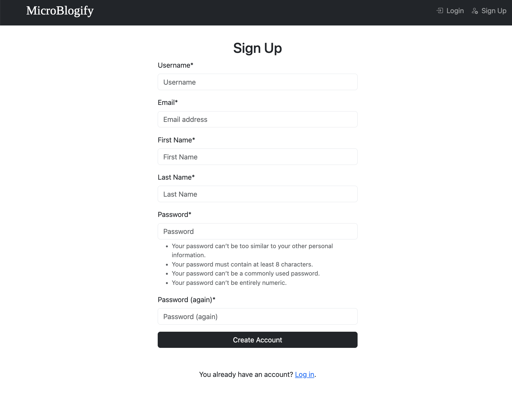

# **Microblogify**

[Live Project on Heroku](https://microblogify-f169ead0df1f.herokuapp.com/)


Welcome to **Microblogify** – a community microblogging platform!

Microblogify is a modern, responsive full-stack web application designed to empower users to express themselves through short, concise blog posts—similar to a microblogging platform. Built with Django and a relational database, Microblogify enables users to share thoughts, and interact with content in a dynamic, community-driven environment.

The platform offers essential features such as user registration, authentication, and role-based access, allowing different levels of interaction based on user status. Authenticated users can create, read, update, and delete posts, while also exploring content from the wider user base. Comments help foster engagement, turning the app into a vibrant space for digital expression.

The design prioritizes accessibility, user experience, and mobile responsiveness, ensuring the site is intuitive and enjoyable to use on all devices. Microblogify was developed using Agile methodologies, with clearly defined user stories guiding its functionality and interface.

Whether you want to share daily updates, thoughts, or start discussions, Microblogify provides a lightweight, social experience tailored for microcontent creators.

The goal is to promote authentic user interactions and community discussions through a well-structured and secure full-stack platform.

---

## **Table of Contents**
- [Microblogify](#microblogify)
  - [Planning](#planning)
    - [Features](#features)
    - [Used Technologies](#used-technologies)
    - [App Owner Goals](#app-owner-goals)
    - [User Stories (prioritized using MoSCoW method)](#user-stories-prioritized-using-moscow-method)
  - [Validation](#validation)
   - [HTML](#html)
  - [Testing](#testing)
    - [Manual Testing](#manual-testing)
    - [Bugs](#bugs)
  - [Deployment](#deployment)
  - [Version Control](#version-control)
  - [Development Process and Git Commands](#development-process-and-git-commands)
  - [Clone and Fork](#clone-and-fork)
  - [Custom 404 Page](#custom-404-page)
  - [Credits](#credits)
  - [FinishedProduct](#finished-product)


---

## **Planning**

### **Features**
- User authentication and role-based access.
- Post creation with Markdown support.
- Commenting functionality.
- Admin dashboard for managing users and posts.
- Responsive design and accessibility-compliant interface.

### **Used Technologies**
- Python, Django, PostgreSQL
- HTML5, CSS3, JavaScript
- Django AllAuth (authentication)
- Cloudinary (image hosting)
- Heroku (deployment)
- Git & GitHub (version control)
- Draw.io / Figma (wireframes and design)
- Markdown (documentation)

---

### **App Owner Goals**
- Provide a safe and friendly microblogging platform.
- Enable easy post interaction through comments.
- Allow administrators to moderate content.
- Provide clear UX/UI feedback to users at every step.

---

### **User Stories (prioritized using MoSCoW method)**

#### **Must Have**

**User Registration**
- *As a new visitor,* I can register for an account so that I can create and manage posts.

**Acceptance Criteria:**
- AC1: When I provide valid registration details, I am successfully registered.
- AC2: I am automatically logged in after registration.

---

**User Login/Logout**
- *As a registered user,* I can log in and log out so that I can access my personal dashboard securely.

**Acceptance Criteria:**
- AC1: Given correct credentials, I can log in.
- AC2: I can log out with one click.

---

**Create Post**
- *As a logged-in user,* I can create a new post so that I can share updates publicly.

**Acceptance Criteria:**
- AC1: I can submit a valid form to create a post.
- AC2: After submission, the new post appears in the feed.

---

**View Posts**
- *As a user,* I can view a list of recent posts so that I can read what others have shared.

**Acceptance Criteria:**
- AC1: The homepage displays the latest posts from all users.
- AC2: Each post includes author, content, and date.

---

**Edit and Delete a Post**
- *As a user,* I can edit or delete my own posts so that I can update or remove content I’ve shared.

**Acceptance Criteria:**
- AC1: Only the author of the post sees “Edit” and “Delete” buttons.
- AC2: Clicking “Edit” opens a form pre-filled with the post content.
- AC3: After saving, the post updates on the detail page.
- AC4: Clicking “Delete” shows a confirmation prompt.
- AC5: After confirming deletion, the post is removed and the user is redirected.

---

**Comment on Post**
- *As a logged-in user,* I can comment on posts so that I can join conversations.

**Acceptance Criteria:**
- AC1: Comments appear below each post.
- AC2: Only logged-in users can comment.

---

#### **Should Have**

**User Profile Page**
- *As a user,* I can view another user's profile so that I can see all their posts.

**Acceptance Criteria:**
- AC1: The profile displays username and profile image.
- AC2: Only that user's posts are listed under the profile.

---

**User Delete Profile**
- *As a logged-in user,* I can delete my profile and all my posts so that I can permanently leave the platform.

**Acceptance Criteria:**
- AC1: A delete button is visible on my profile.
- AC2: A confirmation prompt appears before deletion.
- AC3: Upon confirmation, the profile and all posts are deleted.
- AC4: I am logged out and redirected with a success message.

---

#### **Could Have**

**Follow Users**
- *As a logged-in user,* I can follow and unfollow other users so that I can build my personal feed.

**Acceptance Criteria:**
- AC1: “Follow” button is visible on other user profiles.
- AC2: Followed users' posts appear on a personalized feed.

---

#### **Won’t Have (for now)**

- Private messaging between users  
- Tagging posts with hashtags  
- Real-time notifications


| **Original Story Title**       | **Included** |
|-------------------------------|---------------|
| **Edit and Delete a Post**    | ✅             |
| **Comment on Post**           | ✅             |
| **User Profile Page**         | ✅             |
| **User Delete Profile**       | ✅             |
| **User Registration**         | ✅             |
| **User Login/Logout**         | ✅             |
| **Delete Post**               | ✅             |
| **Edit Post**                 | ✅             |
| **View Posts**                | ✅             |
| **Create Post**               | ✅             |


---

## **Validation**

### **HTML**

| File         | URL                                                                                                                                     | Screenshot                                      |
|--------------|------------------------------------------------------------------------------------------------------------------------------------------|--------------------------------------------------|
| [login.html](blog/templates/account/login.html)       | [Link](https://validator.w3.org/nu/?doc=https%3A%2F%2Fmicroblogify-f169ead0df1f.herokuapp.com%2Faccounts%2Flogin%2F)                     |            |
| [signup.html](blog/templates/account/signup.html)     | [Link](https://validator.w3.org/nu/?doc=https%3A%2F%2Fmicroblogify-f169ead0df1f.herokuapp.com%2Faccounts%2Fsignup%2F)                    |           |
| [base.html](blog/templates/blog/base.html)            | [Link](https://validator.w3.org/nu/?doc=https%3A%2F%2Fmicroblogify-f169ead0df1f.herokuapp.com%2F)                                        |             |
| [post_detail.html](blog/templates/blog/post_detail.html) | [Link](https://validator.w3.org/nu/?doc=https%3A%2F%2Fmicroblogify-f169ead0df1f.herokuapp.com%2Fbuilding-a-family%2F)                 |      |
| [post_form.html](blog/templates/blog/post_form.html)  | [Link](https://validator.w3.org/nu/?doc=https%3A%2F%2Fmicroblogify-f169ead0df1f.herokuapp.com%2Fnew%2F)                                  |        |
| [post_list.html](blog/templates/blog/post_list.html)  | [Link](https://validator.w3.org/nu/?doc=https%3A%2F%2Fmicroblogify-f169ead0df1f.herokuapp.com)                                           |             |
| [profile.html](blog/templates/blog/profile.html)      | [Link](https://validator.w3.org/nu/?doc=https%3A%2F%2Fmicroblogify-f169ead0df1f.herokuapp.com%2Fprofile%2F)                              |          |
| [post-form.html](blog/templates/blog/post-form.html)  | [Link](https://validator.w3.org/nu/?doc=https%3A%2F%2Fmicroblogify-f169ead0df1f.herokuapp.com%2Fnew%2F)                                  |        |
| [404.html](blog/templates/404.html)                   | *(Cannot provide w3 Validator link. Test via direct input due to 404 error)*                                                             |              |

## **Testing**

### **Manual Testing**

| **Test Case**                  | **Action**                                           | **Expected Result**                                     | **Result** |
|-------------------------------|------------------------------------------------------|---------------------------------------------------------|------------|
| Register new user             | Fill and submit the signup form                      | User is registered and redirected                       | ✅          |
| Login/Logout                  | Provide credentials, log in and out                  | Login state changes are reflected                       | ✅          |
| Create post                   | Fill post form and submit                            | Post is created and displayed                           | ✅          |
| Edit/Delete own post          | Use edit/delete options on own post                  | Post is updated/removed from UI and database            | ✅          |
| Add comment                   | Submit comment on a post                             | Comment is displayed under the post                     | ✅          |
| Admin deletes comment         | Admin deletes comment from dashboard                 | Comment is removed                                      | ✅          |
| Access control                | Unauthenticated user tries to create a post          | Redirected to login page                                | ✅          |

---

### **Bugs**
- Initial login redirect not working → Fixed by setting `LOGIN_REDIRECT_URL`.
- Markdown rendering on post detail was buggy → Updated template filter and added sanitization.

---

## **Deployment**

Deployed via **Heroku**.

Steps:
1. Created Heroku app and linked GitHub repo.
2. Added PostgreSQL and Cloudinary add-ons.
3. Config Vars added: `DATABASE_URL`, `SECRET_KEY`, `CLOUDINARY_URL`, etc.
4. Added `Procfile`, `requirements.txt`, `runtime.txt`.
5. Disabled Django debug, ensured `.env` file excluded via `.gitignore`.

Live link: [Microblogify](https://microblogify-f169ead0df1f.herokuapp.com/)

---

## **Version Control**
- Git used throughout, hosted on [GitHub Repo](https://github.com/RazmikMovsisyan/microblogify).
- Clear commit history per feature/bugfix.
- No sensitive info committed.

---

## **Development Process and Git Commands**

- I started the project by using the MS Visual Studio on my local machine.
- I regularly staged changes using the command `git add <filename>` or `git add .`, then committed using `git commit -m 'short descriptive message here'`.
- Finally, I pushed the changes to GitHub with `git push`.
- Every push automatically deploys the latest changes to Heroku from the 'main' branch.

## Clone and Fork the Repository

You can easily clone or fork the **Microblogify** repository for further development.

#### **Fork the Repository**

1. Visit the repository on GitHub: [Microblogify Repository](https://github.com/RazmikMovsisyan/microblogify).
2. Click the **Fork** button to create your own copy.


## Clone and Fork the Repository

You can easily clone or fork the **Microblogify** repository for further development.

#### **Fork the Repository**

1. Visit the repository on GitHub: [Microblogify Repository](https://github.com/RazmikMovsisyan/microblogify).
2. Click the **Fork** button to create your own copy.

#### **Clone the Repository**

The repository has a single branch with a clear commit history. To clone the repository:

##### For **Mac** Users:

1. Open the **Terminal**.
2. Navigate to your preferred directory:  
   ```bash
   cd /path/to/your/directory
   ```
3. Clone the repository:  
   ```bash
   git clone https://github.com/RazmikMovsisyan/microblogify
   ```
4. Navigate into the directory:  
   ```bash
   cd Microblogify
   ```

##### For **Windows** Users:

1. Open **Command Prompt** or **PowerShell**.
2. Navigate to the desired directory:  
   ```cmd
   cd C:\path\to\your\directory
   ```
3. Clone the repository:  
   ```cmd
   git clone https://github.com/RazmikMovsisyan/microblogify
   ```
4. Navigate into the directory:  
   ```cmd
   cd Microblogify
   ```

## Custom 404 Page


A custom **404 error page** has been implemented to handle non-existent routes or broken links. Instead of a generic browser message, users are shown a friendly, styled error page that helps guide them back to the main site — improving overall user experience and navigation.


## Credits

All images featured in this project were sourced from **Stockimages**, ensuring high-quality visuals that enhance the overall design and user experience. These images were selected to complement the content and provide a clean, engaging aesthetic throughout the site.

The favicon used in this project was obtained from **Icons8**. Icons8 offers a wide variety of free and premium icons that are perfect for web development projects, and their favicon collection provided just the right visual touch for this site's branding.

Proper credit is given to all resources used in accordance with fair use and licensing guidelines.

Thank you. 

## Finished Product

